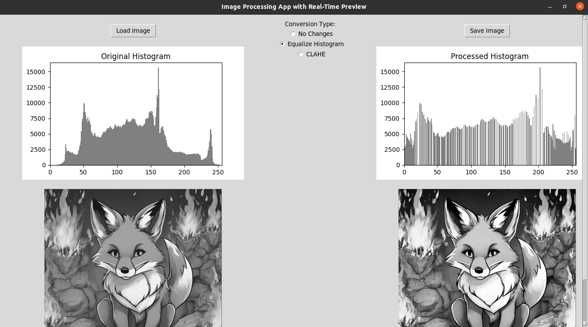
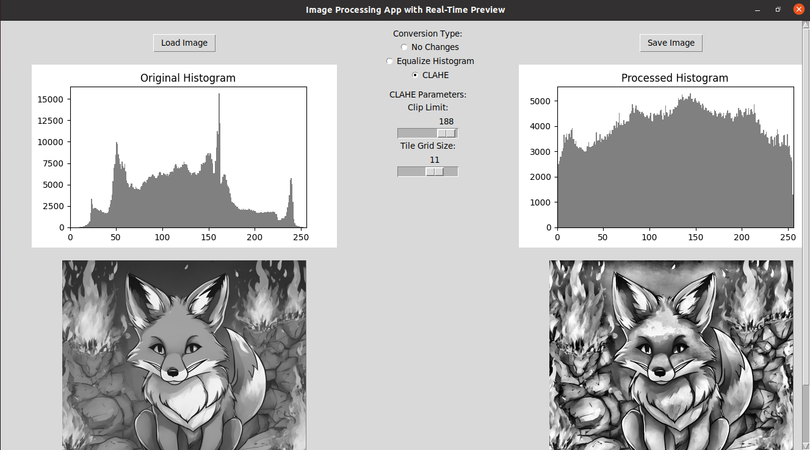

# Image Processing App with Real-Time Preview

This image processing application allows users to load, process, and save images with real-time previews. It supports two advanced image contrast enhancement techniques: Histogram Equalization and Contrast Limited Adaptive Histogram Equalization (CLAHE).

## Key Features:
- **Load Image**: Easily load an image file from your computer.
- **Real-Time Preview**: View both the original and processed images side-by-side, along with their histograms.
- **Image Processing Options**:
  - **No Changes**: View the original image.
  - **Equalize Histogram**: Globally enhance the image contrast by equalizing the histogram.
  - **CLAHE (Contrast Limited Adaptive Histogram Equalization)**: Apply local contrast enhancement using CLAHE.
- **Adjustable CLAHE Parameters**: Customize the level of contrast enhancement by adjusting the **Clip Limit** and **Tile Grid Size** sliders.
- **Save Processed Image**: Save the processed image in PNG format.

---

## Requirements

This application requires the following Python packages for proper functionality:

- `tkinter`: Provides the graphical user interface (GUI).
- `Pillow`: Handles basic image processing and manipulation.
- `numpy`: For numerical operations and array manipulations.
- `opencv-python`: Enables advanced image processing techniques, such as histogram equalization and CLAHE.
- `matplotlib`: For visualizing image histograms and other plots.

To simplify the installation of these dependencies, you can use the `create_env.sh` script, which sets up a Python virtual environment and installs the necessary packages.

---

## Setup and Installation

### Clone the Repository

First, clone the repository to your local machine:

```bash
git clone https://github.com/Jonahida/python-image-equalizer-and-clahe-comparison.git
cd python-image-equalizer-and-clahe-comparison
```

### Set Up the Virtual Environment

After cloning the repository, run the create_env.sh script to set up a Python virtual environment and install all dependencies:

```bash
bash create_env.sh
```

### Activate the Virtual Environment

Once the setup is complete, activate the virtual environment:

```bash
source env39/bin/activate
```

### Run the Application

Finally, run the application:

```bash
python image_processor.py
```

## What the `create_env.sh` Script Does:

### Creates a Virtual Environment:
The script creates an isolated Python environment using `venv`, ensuring that all dependencies are installed within this environment, preventing conflicts with system-level Python packages.

### Installs Dependencies:
The script automatically installs the required dependencies listed in `requirements.txt` using `pip`.

---

## How to Use the Application

### 1. Load an Image:
Click the **Load Image** button to open a file dialog and select an image from your computer.

### 2. Image Processing:
In the **Conversion Type** section, choose one of the processing options:
- **No Changes**: Displays the original image.
- **Equalize Histogram**: Enhances the image contrast by equalizing its histogram.
- **CLAHE**: Enhances contrast locally by applying CLAHE. Use the **Clip Limit** and **Tile Grid Size** sliders to fine-tune the effect.

### 3. Real-Time Preview:
The processed image, along with its histogram, will appear on the right side of the window as you select a conversion option. The original image and its histogram remain on the left.

### 4. Save the Processed Image:
Once satisfied with the processed image, click the **Save Image** button to save it to your computer in PNG format.

---

## GUI Layout

The application is organized into three main sections:

1. **Left Column** (Original Image & Histogram):
   - **Load Image** button to load an image.
   - Displays the **Original Image** and its corresponding **Histogram**.

2. **Center Column** (Image Processing Options):
   - **Conversion Type** section with radio buttons for different processing options:
     - **No Changes**: Displays the original image.
     - **Equalize Histogram**: Enhances the image contrast globally.
     - **CLAHE**: Applies CLAHE for local contrast enhancement.
   - **CLAHE Parameters**: Two sliders to adjust **Clip Limit** and **Tile Grid Size** for CLAHE.

3. **Right Column** (Processed Image & Histogram):
   - **Save Image** button to save the processed image.
   - Displays the **Processed Image** and its corresponding **Histogram**.

---

## Screenshots

### Histogram Example

This screenshot shows the **Original Histogram** of the image displayed in the left column.



### CLAHE Example

This screenshot shows the processed image after applying **CLAHE**, displayed in the right column.



---

## License

This project is licensed under the MIT License. See the [LICENSE](LICENSE) file for more details.
